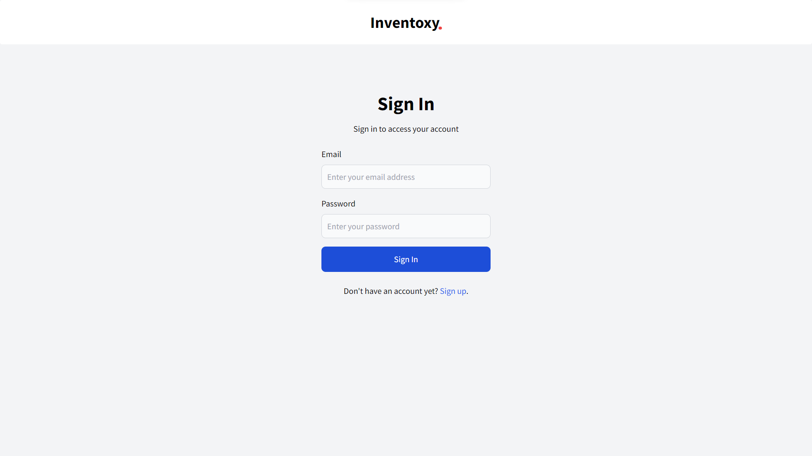

<div align="center">

  <h1>Inventoxy</h1>  
  <p>
    Open source inventory management build with Laravel! 
  </p>

<!-- Badges -->
<p>
  <a href="https://github.com/natainditama/inventoxy/graphs/contributors">
    
  </a>
  <a href="https://github.com/natainditama/inventoxy">
    
  </a>
  <a href="https://github.com/natainditama/inventoxy/network/members">
    
  </a>
  <a href="https://github.com/natainditama/inventoxy/stargazers">
    
  </a>
  <a href="https://github.com/natainditama/inventoxy/issues/">
    
  </a>
  <a href="https://github.com/natainditama/inventoxy/blob/master/LICENSE">
    
  </a>
</p>
   
<h4>
    <a href="https://github.com/natainditama/inventoxy/">View Demo</a>
  <span> · </span>
    <a href="https://github.com/natainditama/inventoxy">Documentation</a>
  <span> · </span>
    <a href="https://github.com/natainditama/inventoxy/issues/">Report Bug</a>
  <span> · </span>
    <a href="https://github.com/natainditama/inventoxy/issues/">Request Feature</a>
  </h4>
</div>

<br />  

<div align="center"> 
  
</div>

<br />  

<!-- About the Project -->
## 📝 About the Project

<!-- Features -->
### 🌟 Features

This project includes the following features:

- Product Management
- Inventory Tracking
- User Authentication
- Advanced Search Options
- Alerts and Notifications

<!-- Color Reference -->
### 🎨 Color Reference

| Color             | Hex                                                                |
| ----------------- | ------------------------------------------------------------------ |
| Primary Color |  #1e40af |
| Background Color |  #f3f4f6 |
| Text Color |  #000000 |

<!-- Env Variables -->
### 🔑 Environment Variables

- `DB_DATABASE` : Name of the database.
- `DB_USERNAME` : The username to access the database.
- `DB_PASSWORD` : The password to access the database.

<!-- Getting Started -->
## 🚀 Getting Started

<!-- Prerequisites -->
### 🔧 Prerequisites

- [PHP](https://www.php.net/)
- [MySQL](https://www.mysql.com/)
- [Composer](https://getcomposer.org/)

<!-- Run Locally -->
### 🏃 Run Locally

Clone the project

```bash
  git clone https://github.com/natainditama/inventoxy.git
```

Go to the project directory

```bash
  cd inventoxy
```

Install the dependencies

```bash
  composer install && yarn install
```

Define your environment file

```bash
  cp .env.example .env
```

Generate the application key

```bash
  php artisan key:generate
```

Start the local server

```bash
  php artisan serve
```

<!-- Contributing -->
## 👋 Contributing

<a href="https://github.com/natainditama/inventoxy/graphs/contributors">
  
</a><br/>

Contributions are always welcome!

See [contributing.md](https://github.com/natainditama/inventoxy/blob/main/.github/CONTRIBUTING.md) for ways to get started.

<!-- Code of Conduct -->
### 📜 Code of Conduct

Please read the [Code of Conduct](https://github.com/natainditama/inventoxy/blob/main/.github/CODE_OF_CONDUCT.md)

<!-- License -->
## ⚠️ License

This project is licensed under the MIT License. See the [LICENSE](https://github.com/natainditama/inventoxy/blob/main/LICENSE) file for details

<!-- Contact -->
## 🤝 Contact

Contact me for inquiries, suggestions, or contributions via the following channels:

- [Email](mailto:natainditama.dev@gmail.com)
- [LinkedIn](https://www.linkedin.com/in/natainditama)
- [GitHub](https://github.com/natainditama)

Thank you for your support, interest, feedback, and contributions!